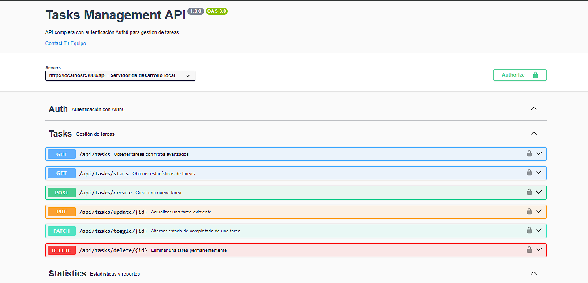
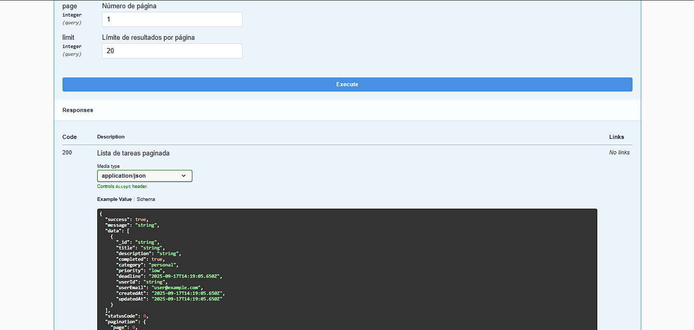

# Task Manager API

API desarrollada con **Node.js**, **TypeScript**, **Express** y **MongoDB**, con autenticación mediante **Auth0**.  
El proyecto está preparado para ejecutarse en local.

---

## 🚀 Requisitos previos

Antes de empezar, asegúrate de tener instalado:

- [Node.js](https://nodejs.org/) (>= 18.x recomendado)
- [npm](https://docs.npmjs.com/) o [pnpm](https://pnpm.io/) (recomendado)
- [MongoDB](https://www.mongodb.com/) (si no usas Docker)
- [Docker](https://www.docker.com/) y [Docker Compose](https://docs.docker.com/compose/) (opcional)

---

## ⚙️ Instalación local

1. **Clona el repositorio:**
   ```bash
   git clone https://github.com/JorgeJ97/task-management-backend.git
   cd task-manager
   ```

2. **Instala las dependencias:**
   ```bash
   pnpm install
   ```
   > También puedes usar `npm install` o `yarn install`.

3. **Configura las variables de entorno:**
   Copia el archivo de ejemplo y ajusta los valores según tu entorno:
   ```bash
   cp .env.example .env
   ```

   Archivo `.env.example`:
   ```env
   AUTH0_ISSUER_BASE_URL=https://my-auth0-issuer.com
   AUTH0_AUDIENCE=https://my-auth0-audience.com
   NODE_ENV=development
   PORT=3000
   DATABASE_URL=mongodb://localhost:27017/taskmanager
   FRONTEND_URL=http://localhost:5173
   ```

4. **Compila y levanta el servidor en desarrollo:**
   ```bash
   pnpm run dev 
   ```
   > También puedes usar `npm run dev`.

   Esto iniciará TypeScript en modo *watch* y `nodemon` para reiniciar el servidor al detectar cambios.

---

## 🛠️ Scripts disponibles

- **`pnpm dev`** → Levanta el servidor en modo desarrollo con recarga automática.  
- **`pnpm build`** → Compila el código TypeScript a JavaScript en la carpeta `dist/`.  
- **`pnpm start`** → Ejecuta la aplicación desde la carpeta `dist/`.  

---


## 📂 Estructura del proyecto (simplificada)

```
.
├── src/              # Código fuente en TypeScript
├── dist/             # Código compilado a JavaScript
├── assets/           # Imágenes y recursos estáticos
├── .env.example      # Variables de entorno de ejemplo
├── package.json
└── README.md
```

---

## 📖 Documentación de la API

La documentación de la API está generada con **Swagger**.  
Puedes acceder a la interfaz de Swagger UI cuando el servidor esté en ejecución en:

```
http://localhost:3000/api-docs
```

### Ejemplo de la documentación con Swagger:

<p align="center">
  
</p>

<p align="center">
  
</p>

---

## 📌 Notas

- La API está configurada para usarse junto a un frontend en `http://localhost:5173`.
- Asegúrate de configurar correctamente tu cuenta de **Auth0** para que `AUTH0_ISSUER_BASE_URL` y `AUTH0_AUDIENCE` coincidan con tu aplicación.

---

## ✨ Autor

Creado por **Jorge Jimenez** 🛠️
